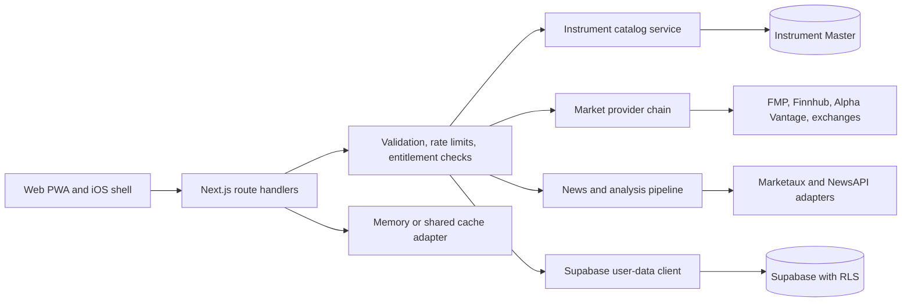

# StockPilot AI architecture

Stand: 2026-08-10

## System boundary

StockPilot AI is a Next.js 16 application with React 19, TypeScript strict,
Supabase, Stripe-ready entitlements, a provider abstraction and a Capacitor iOS
shell. Secrets and provider calls remain on the server. The browser receives
normalized data with provider, timestamp and quality metadata.

## Trust boundaries

- Browser: untrusted input, public Supabase publishable key only.
- Route handlers: validation, authorization, quotas, normalized errors.
- Provider adapters: outbound HTTPS only through the bounded fetch helper.
- Supabase: RLS is the tenant boundary for user data.
- Service role: restricted to the three documented administrative paths.
- Stripe webhook: signature verification replaces request rate limiting.

## Domain boundaries

- `src/lib/instrument-catalog*`: discovery, identity and catalog coverage.
- `src/lib/providers`: market, history, fundamentals, news and AI adapters.
- `src/lib/analysis`: deterministic indicators, valuation and scoring.
- `src/lib/institutional`: lineage, governance and data-quality controls.
- `src/lib/supabase`: authenticated persistence and tenant isolation.
- `src/lib/billing`: entitlements, quotas and Stripe integration.
- `src/app/api`: transport layer only; domain logic stays outside routes.

## Non-negotiable behavior

- Production never falls back to mock data.
- An incomplete catalog never proves that an instrument does not exist.
- Scores are suppressed when source data is insufficient or stale.
- A provider failure returns an explicit degraded/unavailable state.

