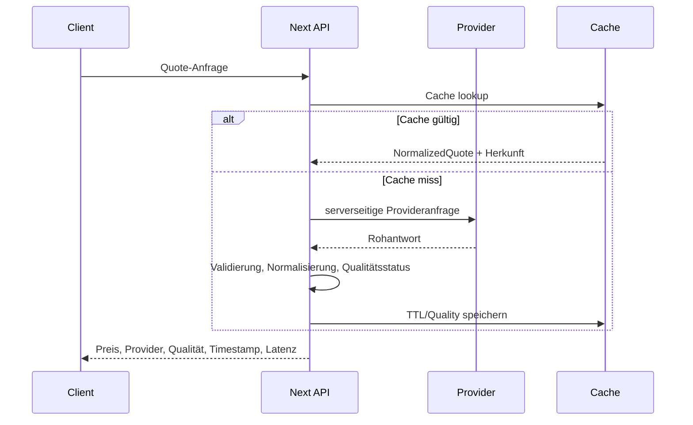
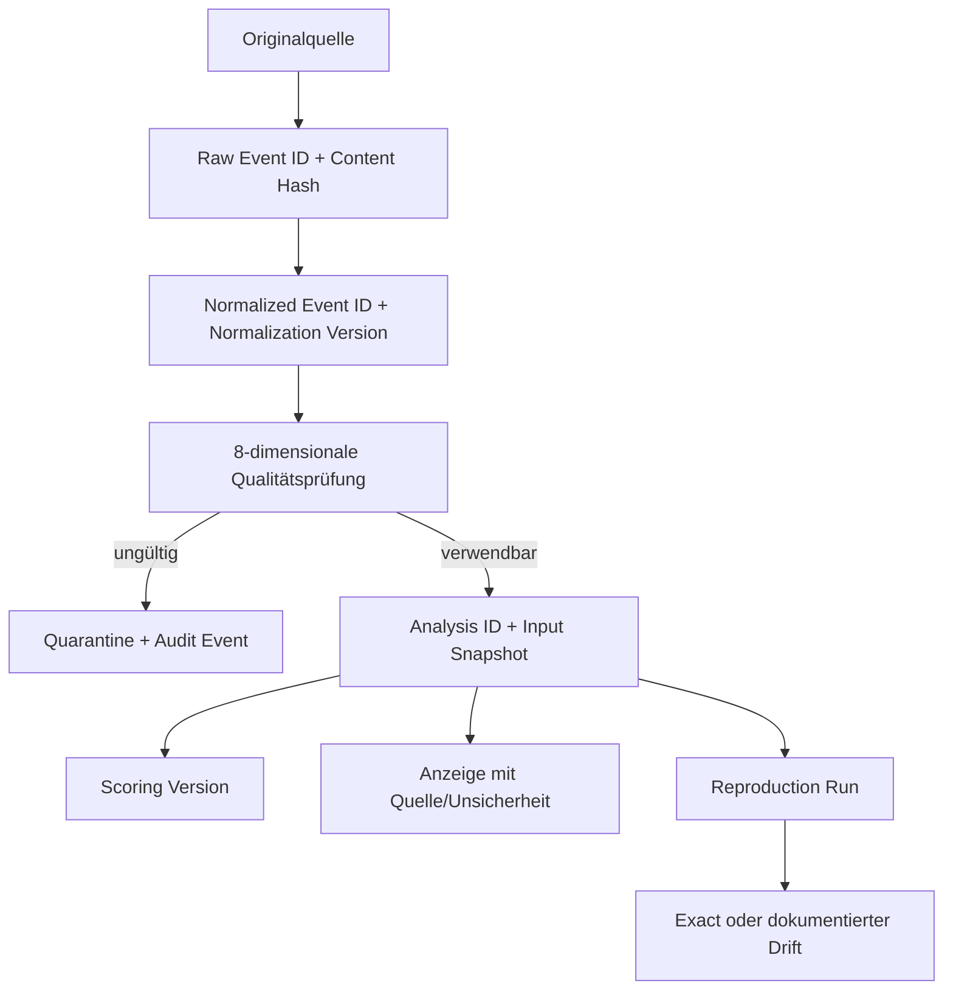

# Datenfluss und Lineage

## Marktquote

## Intelligence-Ereignis

## Pflichtmetadaten

Quelle, Provider, Original-/Abruf-/Effektivzeit, Latenz, Lizenzstatus, Content Hash, Verarbeitungs- und Normalisierungsversion, Modell/Prompt/Scoring-Version, Validierungsstatus und Korrekturstatus.

## Löschung und Retention

Raw Intelligence besitzt standardmäßig 90 Tage Retention. Analysen und Auditnachweise sind append-only; rechtliche Löschung oder Vertragsende benötigt einen kontrollierten, protokollierten Migrationsprozess. Evidence Packs enthalten keine Produktionspayloads.
