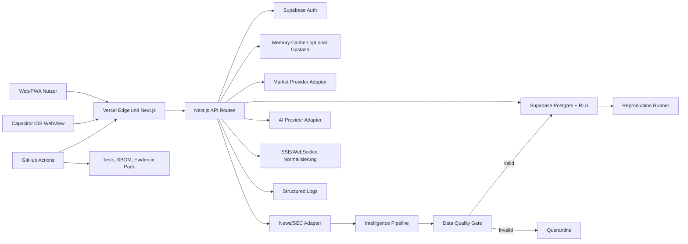

# Systemarchitektur

## Kritische Komponenten

| Komponente | Verantwortung | Schutz | Ausfallverhalten |
| --- | --- | --- | --- |
| Next.js/PWA | UI, BFF, API | CSP, Rate Limit, Validierung | Offline-/Error-State |
| Supabase Auth | Identität/Session | JWT, serverseitige Prüfung | Nutzerfunktionen deaktiviert |
| Postgres | Nutzer-, Portfolio-, Intelligence-Daten | RLS, FKs, Constraints | Read-only/degraded geplant |
| Provider-Adapter | Markt-, News-, Fundamentaldaten | Server-Keys, Timeout, Cache | Fallback/Mock klar markiert |
| Intelligence Pipeline | Ingest, Normalize, DQ, Analyse | Adminsecret, Quarantäne, Idempotenz | Eventfehler isoliert |
| KI-Adapter | Strukturierte Analyse | Prompt-Injection-Grenze, Schema, Limits | Deterministischer Fallback |
| Cache | Kosten/Latenz | TTL, stale window | Memory-Fallback; nicht clusterweit |
| CI/CD | kontrollierte Änderung | Least privilege, manuelles Prod-Gate | Deployment blockiert bei Gatefehler |

## Single Points of Failure

- Supabase-Projekt und primäre Region.
- Vercel-Projektkonfiguration.
- Kein produktiver gemeinsamer Queue-Dienst.
- Kein aktives zentrales SIEM/Tracing.
- Einzelne lizenzierte Datenprovider je Datenkategorie.

## Sensible Daten

- Auth-Identität und Nutzerportfolios: confidential/restricted.
- Server-API-Keys: restricted, niemals im Client oder Evidence Pack.
- Raw Provider Payloads: internal/confidential abhängig vom Vertrag.
- Audit Logs: confidential, server-only.
- Öffentliche Marktdaten: public nur im lizenzierten Umfang.
