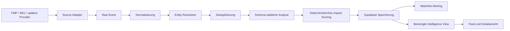

# Realtime Intelligence Architektur

## Modulgrenzen

- `src/lib/intelligence/adapters.ts`: Providerzugriff, Rate Limits, Retry, Cursor und Provider-Fixtures.
- `src/lib/intelligence/analysis.ts`: Normalisierung, Klassifikation, Entity Resolution, Deduplizierung, Analyseprovider und Scoring.
- `src/lib/intelligence/repository.ts`: einzige Supabase-Persistenzgrenze und bereinigte Feed-Abfragen.
- `src/lib/intelligence/pipeline.ts`: idempotente Orchestrierung und strukturierte Metriken.
- `src/app/api/intelligence/ingest/route.ts`: nur mit starkem Server-/Cron-Secret erreichbar.
- `src/app/api/intelligence/events`: öffentliche, rate-limitierte und bereinigte Leseschnittstelle.
- `src/app/intelligence`: mobile Feed- und Detailoberfläche.

## Vertrauensgrenzen

1. Providerinhalt ist grundsätzlich untrusted content.
2. Nur Adapter erzeugen `RawSourceEvent` und validieren HTTPS, Größe und Schema.
3. Rohtext und Rohpayload bleiben serverseitig. Anon und Authenticated erhalten keine Tabellenrechte.
4. Modelle erhalten Quelldaten als gekennzeichnetes JSON und niemals als Systemanweisung.
5. Nur streng validierte Analyseobjekte werden gespeichert.
6. Critical Alerts brauchen zusätzlich eine bestätigte Quelle, Impact mindestens 90 und einen deterministisch erlaubten Ereignistyp.

## Idempotenz

- `(source_id, external_id)` verhindert die erneute Speicherung desselben Providerereignisses.
- `raw_event_id` ist in normalisierten Ereignissen eindeutig.
- Analysen sind über Event, Modell, Promptversion und Input-Hash eindeutig.
- Alerts sind über Nutzer, Ereignis und Alerttyp eindeutig.
- Duplikate werden separat gespeichert und erscheinen nicht erneut im Feed.

## Skalierung

Der erste Worker läuft innerhalb einer Next.js Node-Funktion. Adapter, Repository und Analyzer sind austauschbar, sodass Queue-Worker später ohne Änderung des internen Ereignisformats ausgelagert werden können. Für mehrere Instanzen sind Redis-basierte Rate Limits, verteilte Leases und ein externer Circuit Breaker erforderlich.
